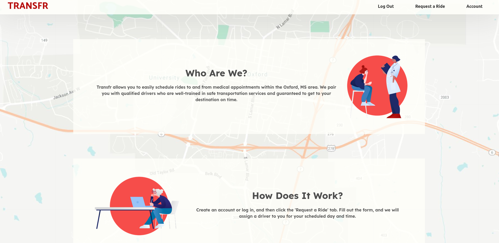
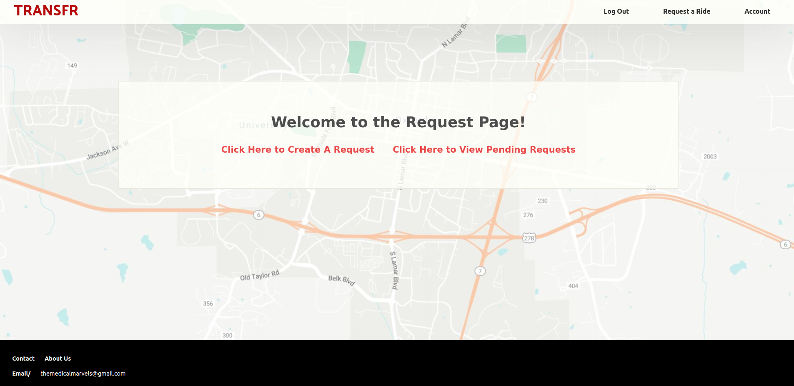
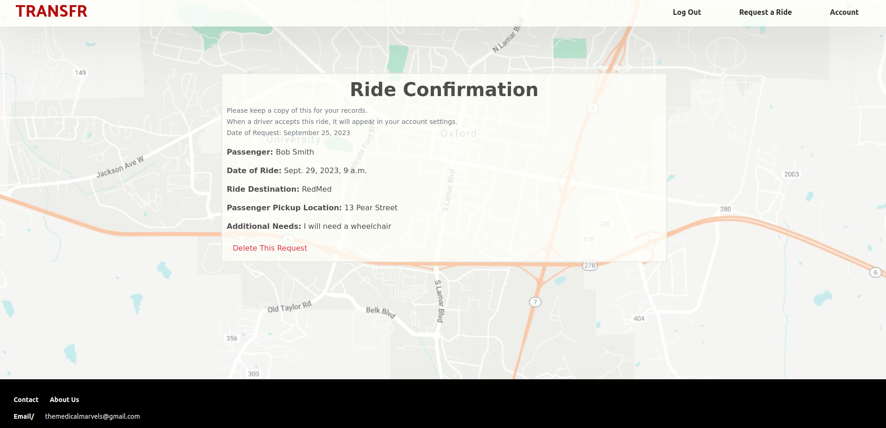

# Transfr-Django
A mock ride share application for people looking for rides to hospitals/doctors offices

To setup:

cd into app/ and create a venv

start the venv and run
pip install -r pipRequirements.txt

python manage.py makemigrations
python manage.py migrate

To run server on localhost:
cd into app/ and run

python manage.py runserver

Open your browser and navagate to localhost:8000

Screenshots of site:

Home Page:

Request a ride hub:

Viewing a ride that has been requested:

